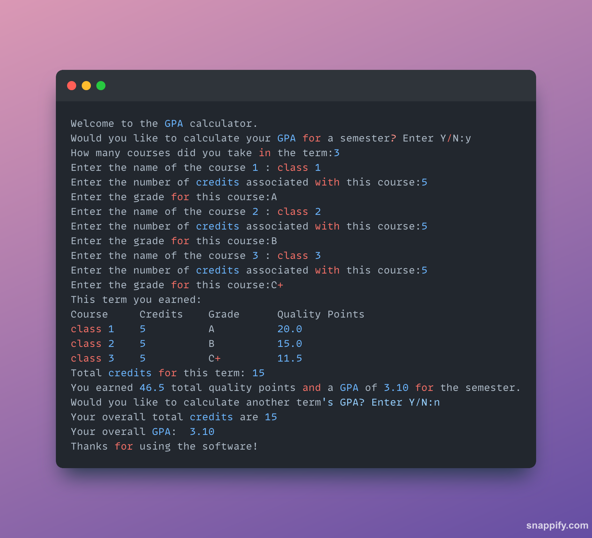

# GPA Calculator

A simple terminal-based Python application that calculates a user's GPA based on the number of classes taken, their respective credit hours, and the grades received.

## Features

Users input the number of classes they have taken.

For each class, users enter:

- The course name
- The number of credit hours
- The grade received

The application calculates and displays the user's GPA.

## Prerequisites

Ensure you have Python installed on your system.

## Installation

Clone this repository or download the script file.

Navigate to the directory containing the script.

## How to Use

Run the script in the terminal:

`python3 gpa-calculator.py`

Follow the on-screen prompts in the terminal and enter the required information.

The application will output the calculated GPA.

## Example

```
Welcome to the GPA calculator.
Would you like to calculate your GPA for a semester? Enter Y/N:y
How many courses did you take in the term:3
Enter the name of the course 1 : class 1
Enter the number of credits associated with this course:5
Enter the grade for this course:A
Enter the name of the course 2 : class 2
Enter the number of credits associated with this course:5
Enter the grade for this course:B
Enter the name of the course 3 : class 3
Enter the number of credits associated with this course:5
Enter the grade for this course:C+
This term you earned:
Course     Credits    Grade      Quality Points
class 1    5          A          20.0
class 2    5          B          15.0
class 3    5          C+         11.5
Total credits for this term: 15
You earned 46.5 total quality points and a GPA of 3.10 for the semester.
Would you like to calculate another term's GPA? Enter Y/N:n
Your overall total credits are 15
Your overall GPA:  3.10
Thanks for using the software!
```



## Grading Scale

The program assumes the following grade-to-GPA conversion:

- A = 4.0
- A- = 3.7
- B+ = 3.3
- B = 3.0
- B- = 2.7
- C+ = 2.3
- C = 2.0
- C- = 1.7
- D+ = 1.3
- D = 1.0
- F = 0.0
